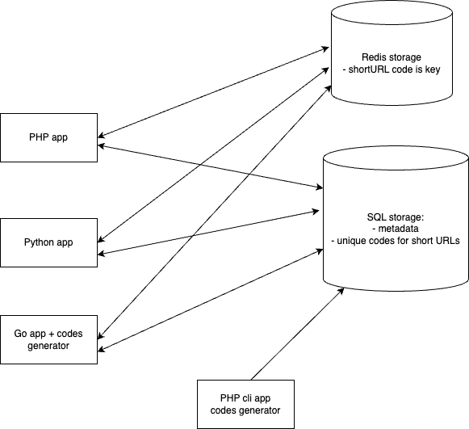

## URL shortener service written in different programming languages/frameworks

-   PHP (Symfony)
-   Python (FastAPI)
-   Go

## System design



MySQL database is used to store available and used unique codes (each short URL contains a unique 8-character code). Applications do not generate codes in real time, codes are pre-generated in background and they are unique.

Redis is used as a key-value storage to store full URLs according to short URLs to access them in O(1) time

## Installation

```
make build
```

## Usage

Run the project

```
make up
```

APIs will be available:

```
# PHP
GET http://localhost:8081/{shortURL}
POST http://localhost:8081/api/url

# Go
GET http://localhost:8082/{shortURL}
POST http://localhost:8082/api/url

# Python
GET http://localhost:8083/{shortURL}
POST http://localhost:8083/api/url
```

POST request body example (type: application/json)
```
{
    "url": "https://example.com"
}
```

## Performance testing

We use K6 tool in Docker, to run it

```
make load_test_symfony
make load_test_go
make load_test_fastapi
```